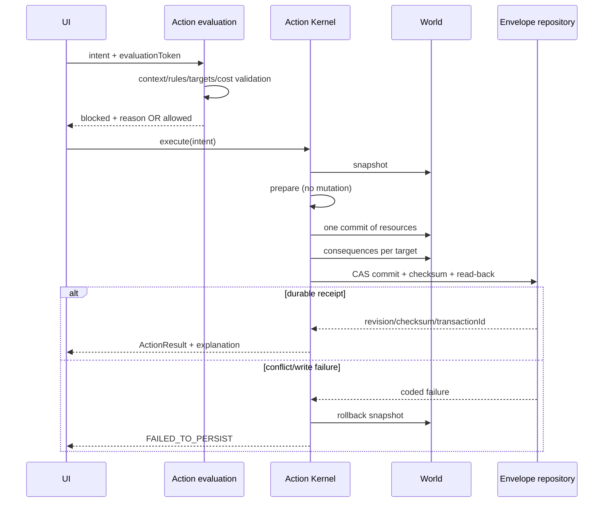

# Потоки данных

## Игровое действие

Игровые кости не генерируются: roll requirements переходят в UI, а игрок/мастер вводит фактические значения. `ResourceCommitToken` отклоняет повторный коммит одного resource key.

## Локальное сохранение

1. Runtime создаёт `world-snapshot/1` как state payload.
2. `ProjectionCache.stripDerived` удаляет объявленные вычисляемые поля.
3. `EnvelopeRepository.commit` сверяет expected revision.
4. Создаётся `campaign-envelope/1` с parent revision, ruleset/catalog refs и SHA-256.
5. Storage adapter выполняет compare-and-set.
6. Репозиторий читает запись обратно и выдаёт durable receipt.
7. Legacy snapshot/per-key keys записываются только для переходной совместимости.

Повреждённый envelope не трактуется как пустая новая кампания. Старый snapshot мигрируется один раз, исходные bytes сохраняются в backup.

## Облачная синхронизация

1. Канал запоминает `remoteRevision` и `dirtyParentRevision`.
2. Перед отправкой выполняется Firebase GET с `X-Firebase-ETag`.
3. `cloudCasPlan` сравнивает удалённую revision с dirty parent.
4. PUT отправляется с `if-match` и новым parent/revision.
5. HTTP 412 или revision mismatch показывается как конфликт; локальные изменения не стираются.

## Торговля

`MerchantService` делает preflight stock/category/price/funds/revision, затем в одной транзакции меняет exact-minor wallets, stock и inventory. Request ID защищает от replay. Ошибка journal commit возвращает все четыре части snapshot. Недостаток денег торговца требует подтверждённый GM override с автором и причиной.

## Каталог

Source manifest → ruleset/source/license gate → duplicate/expected-ID/executable coverage → import plan → Definition layer. Локальные spell/features остаются открытым авторским набором, а `open5e-cc-v1` теперь имеет отдельный зафиксированный census: 837 retained spells и 616 retained features с CC-BY provenance. Полнота заявляется только относительно выбранных документов, не относительно всех когда-либо изданных материалов D&D.
