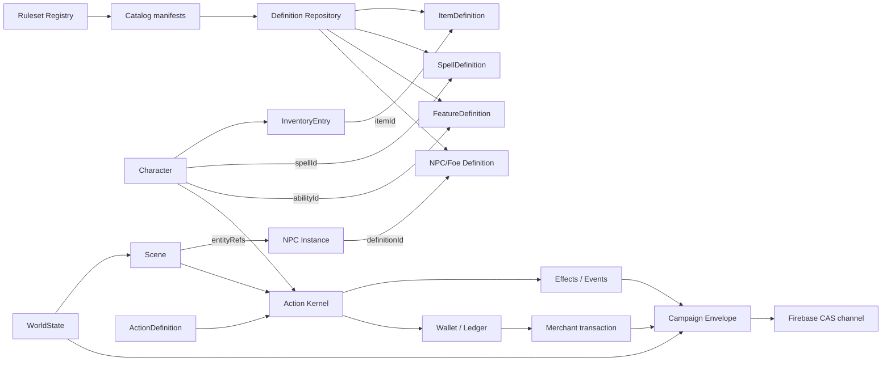

# Карта домена

## Сущности и идентичность

| Сущность | Идентификатор | Владелец жизненного цикла | Ссылки |
|---|---|---|---|
| Ruleset | `id@version[:profile]` | `RulesetRegistry` | catalog/definition rulesetRef |
| Catalog | catalog ID + version/hash | Catalog governance/pinned manifest | definition IDs, artifacts |
| Definition | `kind:id` | `DefinitionRepository` | rulesetRef, source layer |
| Character | character ID | Campaign state | inventory, spellbook, abilities, wallet |
| InventoryEntry | entry ID | Character | itemId, qty, instance value/container/equipment refs |
| MerchantInstance | merchant ID + revision | Merchant state | templateId, itemId stock, wallet |
| Scene | scene ID + revision | WorldState | NPC entityRefs, zones, environment |
| NPC Instance | NPC ID + revision | WorldState | definitionId, sceneId, inventory refs |
| ActionDefinition | action ID + definition version | engine adapter | source, costs, targets, ruleset |
| ActionEvaluation | action ID + context/evaluation token | Action Kernel | allowed/reason/targets/cost preview |
| ActionResult | action ID + audit ID | Action Kernel | effects, resource spends, events, persistence receipt |
| CampaignEnvelope | campaign ID + revision | EnvelopeRepository | parentRevision, rulesetRefs, catalogRefs, checksum |

## Запрещённые зависимости

- UI не исполняет текст `desc/x/props` как механику.
- InventoryEntry не встраивает ItemDefinition.
- Merchant stock хранит только Item ID и instance fields.
- Derived projection не сохраняется в Campaign Envelope.
- Generator draft не меняет WorldState без validation и GM approval.
- Ruleset extension не подменяет полноту родительского каталога.

## Переходные границы

`combat`, `bg3SceneState` и `bg3StoryState` всё ещё меняются старым runtime и сохраняются рядом с `worldState`. Это явно переходная граница. До удаления legacy write-path `worldState` нельзя объявлять единственным источником сцены.
